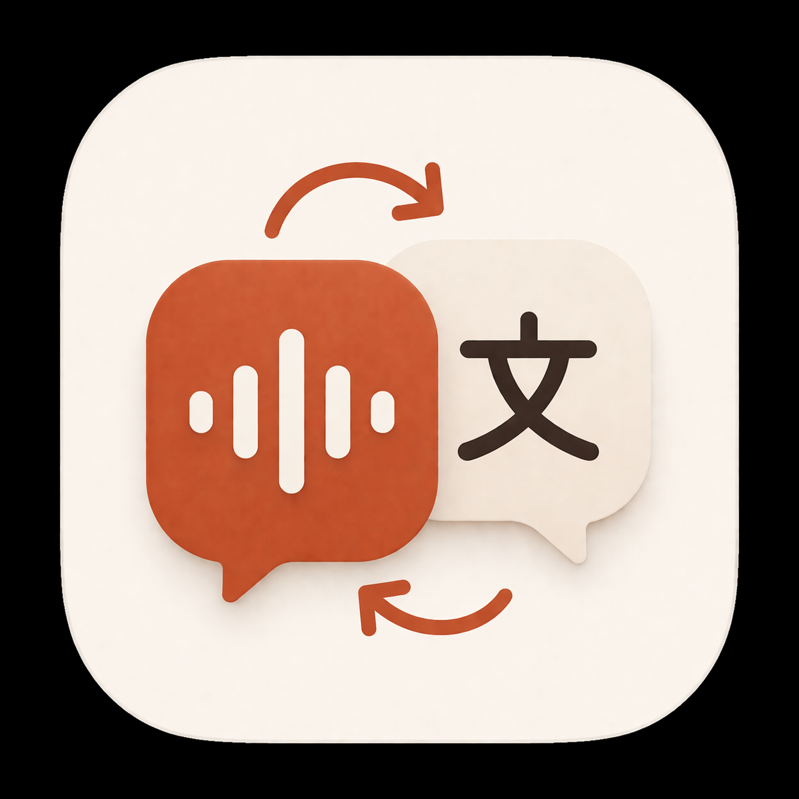
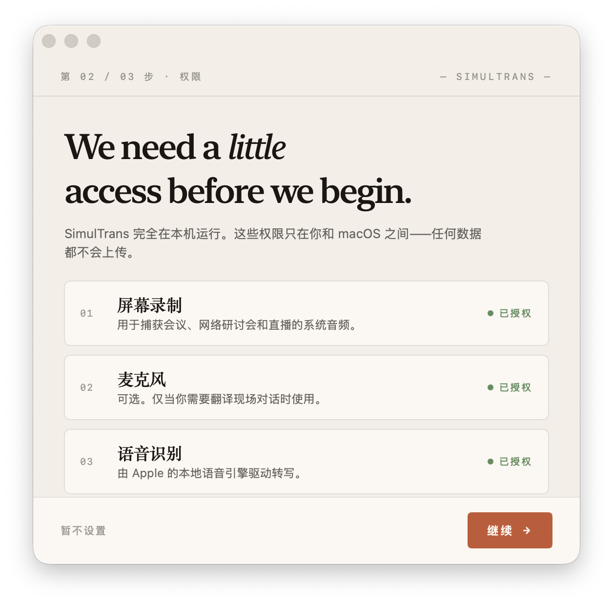
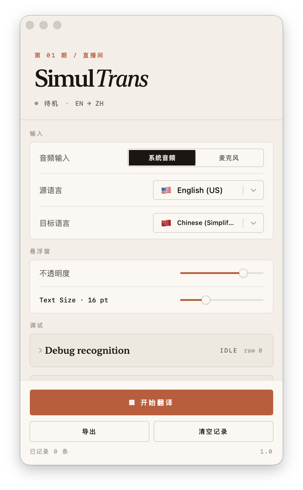
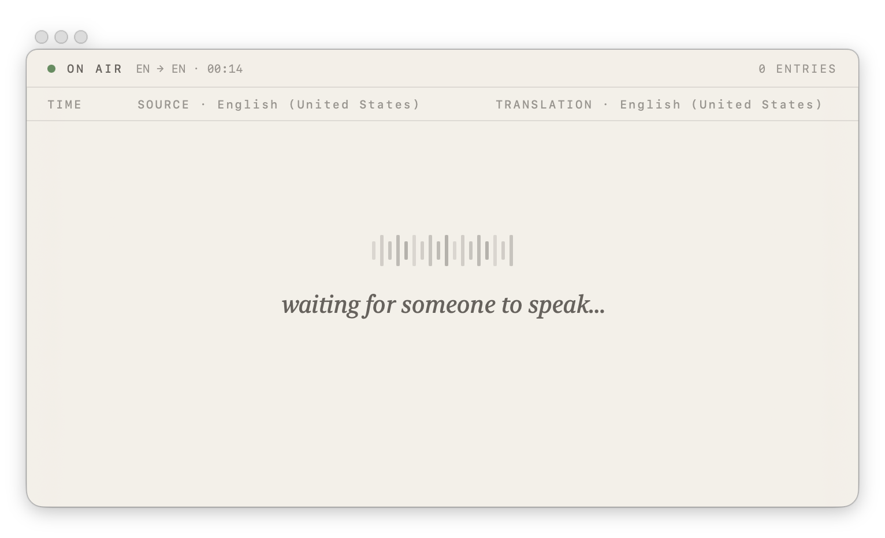
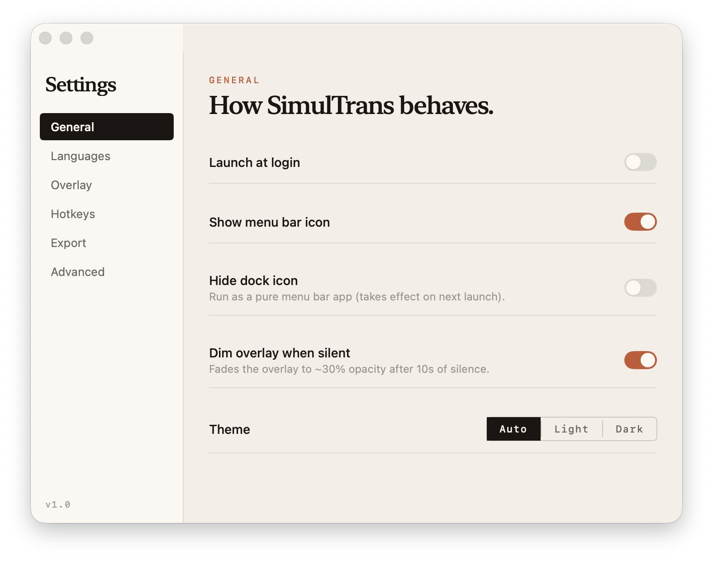
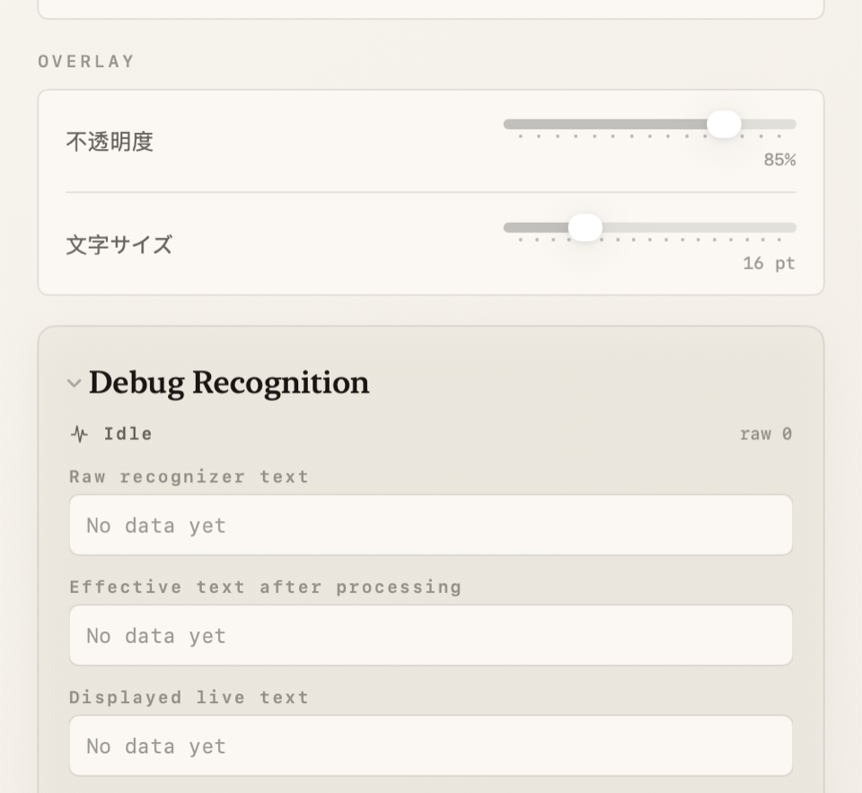

# SimulTrans



SimulTrans is a native macOS app for real-time speech transcription and translation.
It listens to either system audio or microphone input, transcribes speech with Apple's speech stack, translates the result with the `Translation` framework, and presents both source text and translated text in a lightweight floating overlay.

The idea is simple: make a practical, local-first alternative to expensive live interpretation tools.

## Download

[Download the latest macOS build](https://github.com/Macha1234/SimulTrans/releases/latest/download/SimulTrans.dmg)

If you prefer to inspect the full release page, changelog, and checksum files first, open:

- [Latest release](https://github.com/Macha1234/SimulTrans/releases/latest)

## Why This Project Exists

Many real-time translation tools are paid products, and a lot of them are expensive for what should be a simple utility workflow.
SimulTrans is built for people who want a fast macOS desktop tool for meetings, livestreams, webinars, classes, and everyday listening across languages without depending on a subscription-heavy stack.

## What SimulTrans Does

- Capture either system audio or microphone input
- Transcribe live speech in real time
- Translate the recognized text into a target language
- Show source and translated text side by side in a floating overlay
- Preserve completed lines in history instead of letting new speech overwrite earlier content
- Provide a redesigned control window for language, input, overlay, export, and debugging
- Include a first-run permission onboarding flow and a dedicated Settings window
- Export transcript history as a plain-text file

## Recent Refresh

This round of work focused on making the app feel more like a polished desktop product instead of a rough prototype:

- A redesigned editorial-style interface with bundled fonts and a more compact window footprint
- A refreshed app icon and updated app bundle resources
- A first-run onboarding flow for Screen Recording, Microphone, and Speech Recognition permissions
- A separate Settings window for appearance, language, overlay, and advanced controls
- A menu bar popover surface for quick access
- Better handling of live transcript segmentation so finished lines are preserved more reliably
- A recognition debug surface that makes raw, processed, and displayed text easier to compare

## Screenshot Tour

The app follows the host system language, so the screenshots below may show a mix of English, Chinese, and Japanese UI text depending on the capture environment.

### First-Run Permission Onboarding

The onboarding window makes the initial macOS permission flow much easier to understand. It surfaces the three permissions the app may need and keeps the first-run experience inside the app instead of forcing the user to guess what is missing.



### Main Control Window

The control window is the main hub for the app. It exposes:

- Audio input selection
- Source and target language routing
- Overlay opacity and text size
- Start / stop actions
- Export and clear-history actions
- Recognition debugging tools



### Floating Live Overlay

The floating overlay is designed for actual use while watching content or sitting in a meeting. It keeps historical lines visible, shows source text and translated output side by side, and preserves a lightweight presentation so it can stay on screen without taking over the desktop.



### Settings Window

The Settings window gives the app a more desktop-native feel and keeps secondary controls out of the main translation workflow. It currently covers appearance, language routing, overlay behavior, export details, hotkey placeholders, and advanced diagnostics.



### Recognition Debug Surface

When speech recognition behaves unexpectedly, the built-in debug area helps compare raw recognizer output, processed text, and displayed text. This has been especially useful while tuning partial recognition behavior and avoiding destructive overwrites in the live row.



## Recognition And Translation Approach

SimulTrans is intentionally built around Apple's native frameworks instead of paid third-party APIs.

- It prefers Apple's modern speech transcription pipeline when available on the current macOS version
- It falls back to the classic `SFSpeechRecognizer` pipeline where needed
- It translates text through Apple's `Translation` framework
- It keeps a live row for in-progress speech while committing stable/final speech into transcript history
- It uses extra debugging surfaces to compare recognizer output against the text actually shown in the UI
- On the classic recognizer path, it keeps a short rolling audio prebuffer to reduce dropped words when the recognition task restarts between utterances

In practice, that means the app tries to stay lightweight and local-first while still behaving like a usable daily tool instead of a demo.

## Typical Use Cases

- Following overseas livestreams with translated subtitles
- Watching webinars or presentations in another language
- Listening to meetings while keeping a running bilingual transcript
- Saving important spoken content with both the source text and the translated result
- Comparing recognizer output during speech tuning and debugging

## Quick Start

1. Launch the app and complete the first-run permission flow if needed.
2. Choose `System Audio` or `Microphone`.
3. Pick the spoken language and the translation target.
4. Adjust overlay opacity and text size if you want.
5. Press `Start Translation`.
6. Keep the floating overlay on screen while the control window manages history, export, and debugging.

## Install On macOS

1. Download `SimulTrans.dmg` from the latest GitHub release.
2. Open the DMG and drag `SimulTrans.app` into `Applications`.
3. Launch the app from `Applications`.
4. On first launch, macOS may block the app because it is distributed outside the App Store.
5. If that happens, either:
   - Right-click the app and choose `Open`
   - Or open `System Settings > Privacy & Security` and press `Open Anyway`
6. Grant Screen Recording, Microphone, and Speech Recognition permissions when prompted.

## GitHub Release Builds

GitHub Releases are now the main download channel for this project.

- The direct download link always points to `SimulTrans.dmg`
- Each tagged release also includes a versioned DMG
- SHA-256 checksum files are uploaded alongside the DMG assets
- Builds are packaged automatically by GitHub Actions when a `v*` tag is pushed

Current release builds are distributed outside the Mac App Store and are not notarized, so the first launch experience may include an extra Gatekeeper confirmation step.

## Requirements

- macOS 15 or later
- Xcode 16 / Swift 6 for local development
- Screen Recording permission for system audio capture
- Microphone permission for microphone mode
- Speech Recognition permission for transcription
- Better results on newer macOS versions where Apple's modern speech pipeline is available
- Some language pairs may require macOS speech or translation assets to be downloaded first

## Development

Build the project:

```bash
swift build
```

Build, package into an app bundle, install locally, and launch:

```bash
./build_and_run.sh
```

Use your own signing identity if needed:

```bash
SIGNING_ID="Apple Development: Your Name" ./build_and_run.sh
```

By default, the script prefers the `SimulTrans Dev` signing identity when available, installs the app to `~/Applications/SimulTrans.app`, and also writes the bundle to `dist/SimulTrans.app`.

## Packaging

Create a DMG:

```bash
./package.sh
```

Override the version if needed:

```bash
VERSION=1.0.1 ./package.sh
```

Artifacts are written to `dist/`.

## Publishing A Release

For maintainers, publishing a new downloadable GitHub release is:

```bash
git tag v1.0.1
git push origin v1.0.1
```

Pushing a `v*` tag triggers the GitHub Actions release workflow, which builds the app on macOS, packages the DMG, generates SHA-256 files, and uploads the assets to GitHub Releases.

## Project Structure

```text
.
├── AppTemplate/        # Template app bundle used for packaging
├── Sources/            # Main app source code
├── assets/             # Logo and README screenshots
├── build_and_run.sh    # Build, sign, install, and launch locally
├── package.sh          # Release build + DMG packaging
├── generate_icon.py    # Generates AppIcon.icns from the logo source
└── debug_ax.swift      # Optional accessibility/debug helper
```

## Tech Stack

- Swift Package Manager
- AppKit + SwiftUI
- `Speech`
- `ScreenCaptureKit`
- `Translation`

## Permissions

Depending on the workflow, the app may request:

- Screen Recording
- Microphone
- Speech Recognition

These can be managed from macOS System Settings > Privacy & Security.

## Notes

- The app UI follows the system language where localizations are available.
- `debug_ax.swift` is a helper script and is not required for normal usage.
- Build artifacts, DMGs, and temporary outputs are excluded from git.
