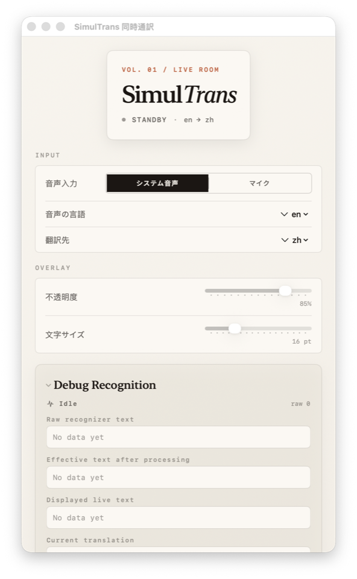

# SimulTrans

SimulTrans is a macOS app for real-time speech transcription and translation. It captures either system audio or microphone input, transcribes speech with Apple's built-in speech stack, and translates the result with the `Translation` framework.

The goal is simple: a lightweight local-first alternative to expensive live interpretation tools.

## Highlights

- Capture system audio or microphone input
- Show live transcript and translation in a floating overlay
- Keep completed utterances in a running history instead of letting new speech overwrite them
- Use Apple's newer speech pipeline when available, with fallback to the classic recognizer
- Auto-select a sensible default target language based on the system language
- Inspect raw recognizer output in a built-in debug panel
- Export transcript history to a text file
- Build and package as a native macOS app

## Why This Exists

A lot of live translation tools are paid products, and many of them are not cheap. SimulTrans is meant to be a practical macOS alternative for meetings, livestreams, webinars, and everyday cross-language listening.

## Use Cases

- Follow English meetings with translated subtitles
- Watch overseas livestreams or webinars with live translation
- Save important spoken content with both source text and translation

## Quick Start

1. Choose `System Audio` or `Microphone`.
2. Pick the spoken language and translation target.
3. Press `Start Translation`.
4. Grant macOS permissions the first time you run it.
5. Watch the floating overlay update in real time while the control window keeps the running history and debug surface.

## Screenshots

### Control Panel

The redesigned control window keeps the setup workflow simple while surfacing the live state, input settings, overlay controls, and transcript actions.



### Recognition Debug View

The built-in debug area helps compare raw recognizer output against the processed and displayed text when tuning the transcription experience.


## Tech Stack

- Swift Package Manager
- AppKit + SwiftUI
- `Speech`
- `ScreenCaptureKit`
- `Translation`

## Requirements

- macOS 15 or later
- Xcode 16 / Swift 6
- Microphone / Speech Recognition / Screen Recording permissions on first use
- Best recognition quality on newer macOS versions where the modern speech pipeline is available
- Some languages may require macOS to download speech or translation assets

## Project Structure

```text
.
├── AppTemplate/        # Template app bundle used for packaging
├── Sources/            # Main app source code
├── build_and_run.sh    # Build and launch for local development
├── package.sh          # Release build + DMG packaging
├── generate_icon.py    # Generates AppIcon.icns
└── debug_ax.swift      # Optional accessibility/debug helper
```

## Development

Build normally:

```bash
swift build
```

Build and launch the app:

```bash
./build_and_run.sh
```

Use your own signing identity if needed:

```bash
SIGNING_ID="Apple Development: Your Name" ./build_and_run.sh
```

By default, the script prefers the `SimulTrans Dev` signing identity when available, installs the app to `~/Applications/SimulTrans.app`, and also writes the build output to `dist/SimulTrans.app`.

## Notes on Recognition

- SimulTrans now prefers Apple's modern speech transcription pipeline on supported systems.
- A built-in debug panel in the control window shows raw recognizer text, processed text, and displayed live text side by side.
- The app is designed to preserve the current lightweight local workflow rather than depend on external paid APIs.

## Packaging

Create a DMG:

```bash
./package.sh
```

Override the version if needed:

```bash
VERSION=1.0.1 ./package.sh
```

Artifacts are written to `dist/`.

## Permissions

Depending on the input source and workflow, the app may request:

- Microphone
- Speech Recognition
- Screen Recording

Grant these from macOS System Settings > Privacy & Security.

## Notes

- `debug_ax.swift` is a helper script and is not required for normal use.
- Build artifacts, DMGs, and temporary outputs are excluded from git.
